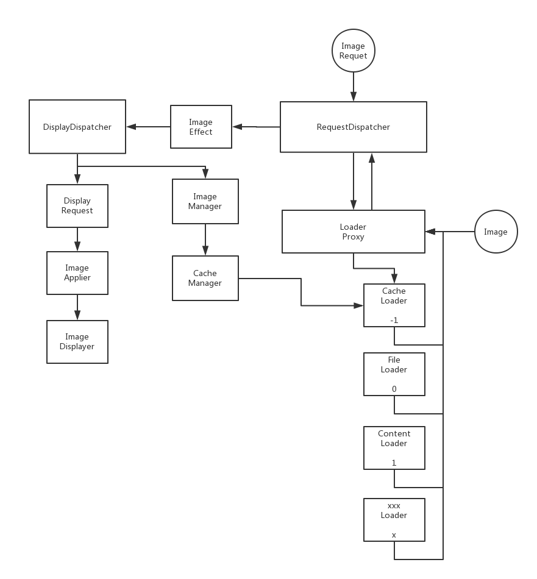

# VanGogh

## Design

### Func design



### App demo


## Usage

[](https://jitpack.io/#Tornaco/VanGogh)

```
compile 'com.github.Tornaco:VanGogh:v0.1-alpha'
```

### API

```java
 Vangogh.with(InstrumentationRegistry.getContext())
                .load(Uri.EMPTY)
                .placeHolder(R.drawable.ic_home_black_24dp)
                .fallback(R.drawable.ic_dashboard_black_24dp)
                .applier(new FadeInApplier())
                .effect(new CircleImageEffect())
                .skipDiskCache(false)
                .skipMemoryCache(true)
                .usingLoader(new CustomLoader())
                .into(imageView);
```

### Config

* The dafault config we used:
```java
static VangoghConfig defaultConfig(Context context) {
        return VangoghConfig
                .builder()
                .context(context)
                .diskCacheDir(new File(context.getCacheDir().getPath() + File.separator + "disk_cache"))
                .memCachePoolSize(64)
                .requestPoolSize(Runtime.getRuntime().availableProcessors() / 4)
                .build();
    }

```

* Use custom config:
```java
VangoghConfig config = xxxx;
Vangogh.with(context, customConfig)
```
